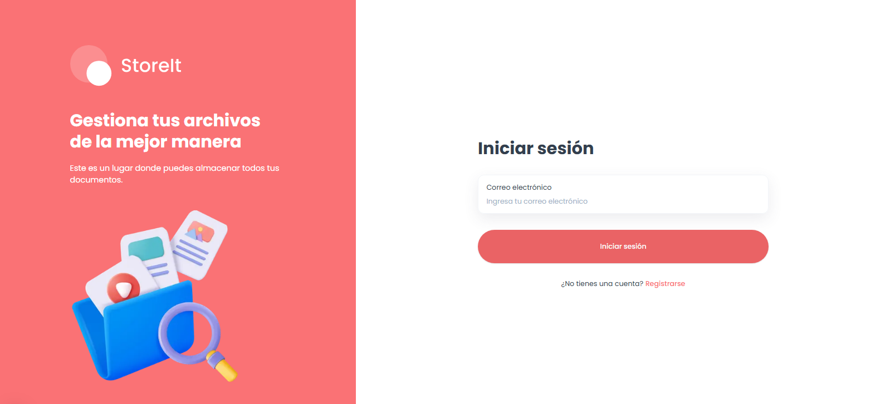
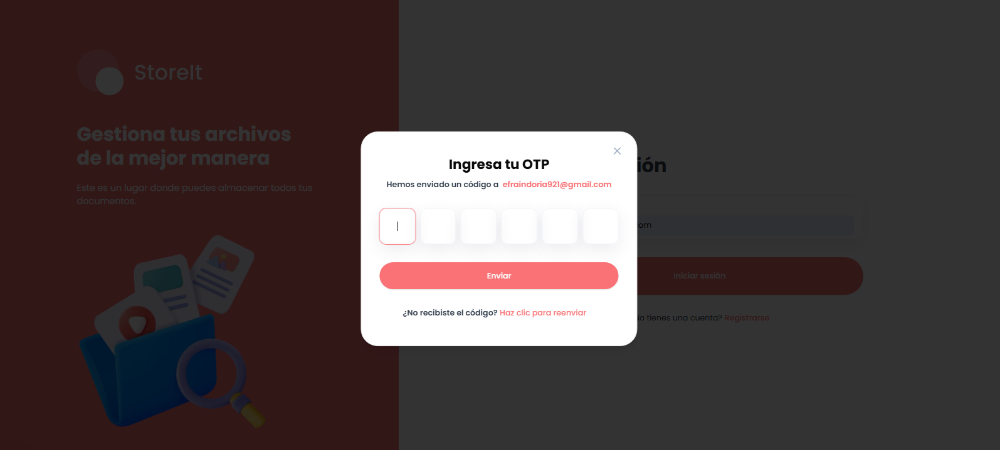
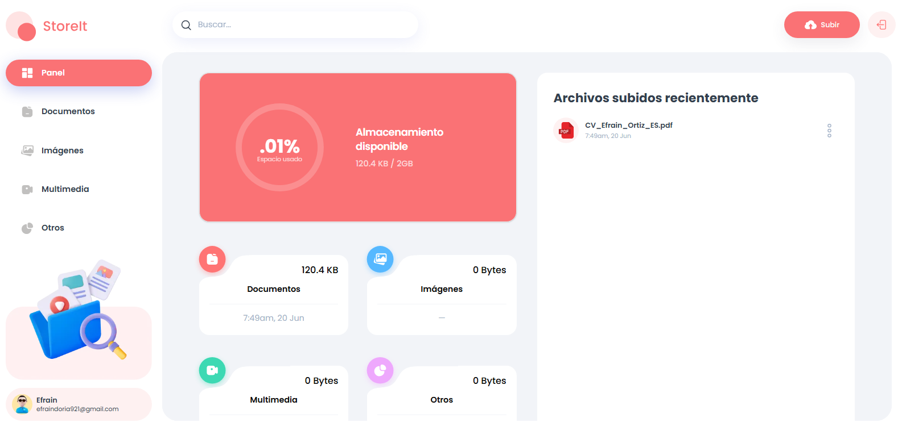
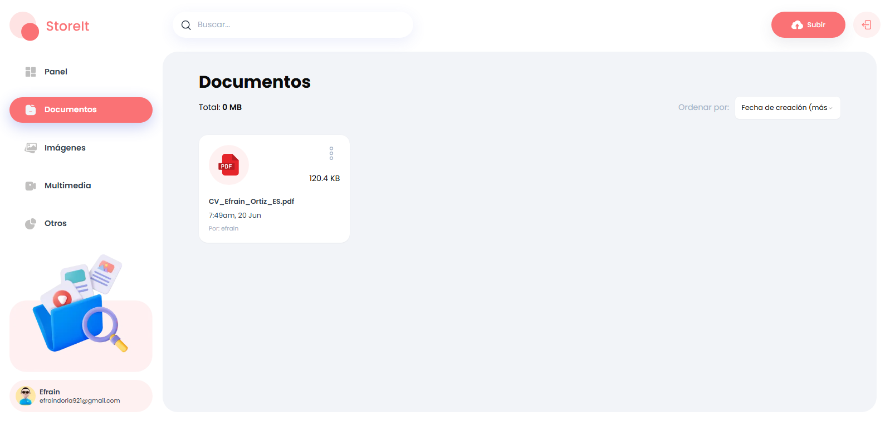

<div align="center">

# 🔐 StoreIt

### The only storage solution you need

A modern **file storage & sharing** web app built with **Next.js 15**, **React 19** and **Appwrite**. Upload, organize, share and manage your files from any device.


**English** · [Español](./README.es.md)

</div>

---

## 📋 Table of contents

- [Features](#-features)
- [Screenshots](#-screenshots)
- [Tech stack](#-tech-stack)
- [Architecture](#-architecture)
- [Project structure](#-project-structure)
- [Getting started](#-getting-started)
- [Appwrite setup](#-appwrite-setup)
- [Environment variables](#-environment-variables)
- [Available scripts](#-available-scripts)
- [Authentication flow](#-authentication-flow)
- [File data model](#-file-data-model)
- [Code conventions](#-code-conventions)

---

## ✨ Features

- 🔑 **Passwordless authentication** — sign in via OTP (One-Time Password) sent by email.
- 📤 **File uploads** — drag & drop powered by `react-dropzone` (50 MB per-file limit).
- 🗂️ **Category organization** — files are automatically bucketed into `Documents`, `Images`, `Media` and `Others` based on their extension.
- 🔍 **Global search** — real-time file search with debounce.
- ↕️ **Sorting** — by creation date, name or size (ascending/descending).
- ✏️ **File management** — rename, view details, download and delete.
- 🤝 **Sharing** — share files with other users by email; recipients see files shared with them.
- 📊 **Dashboard with metrics** — storage usage chart (`recharts`) and per-type summary.
- 📱 **Responsive design** — dedicated mobile navigation and an experience adapted to all screen sizes.

---

## 📸 Screenshots

| Sign in | OTP verification |
|:---:|:---:|
|  |  |

| Dashboard | File upload |
|:---:|:---:|
|  |  |

| Category view & sharing |
|:---:|
|  |


---

## 🛠️ Tech stack

### Framework & Core
| Technology | Version | Purpose |
|------------|---------|---------|
| **[Next.js](https://nextjs.org/)** | 15.0.2 | React framework with App Router and Turbopack |
| **[React](https://react.dev/)** | 19 (RC) | UI library |
| **[TypeScript](https://www.typescriptlang.org/)** | 5 | Static typing |

### Backend & Data
| Technology | Version | Purpose |
|------------|---------|---------|
| **[Appwrite](https://appwrite.io/)** (`node-appwrite`) | 14.2.0 | Full backend: authentication, database and file storage |
| **Next.js Server Actions** | — | Data layer (no API routes, no middleware) |

### UI & Styling
| Technology | Version | Purpose |
|------------|---------|---------|
| **[shadcn/ui](https://ui.shadcn.com/)** | — | Radix-based components (`components/ui/`) |
| **[Radix UI](https://www.radix-ui.com/)** | various | Accessible primitives (dialog, dropdown, select, toast…) |
| **[Tailwind CSS](https://tailwindcss.com/)** | 3.4.1 | Utility-first styling |
| **[tailwind-merge](https://github.com/dcastil/tailwind-merge)** / **[clsx](https://github.com/lukeed/clsx)** | — | Class composition |
| **[class-variance-authority](https://cva.style/)** | 0.7.0 | Component variants |
| **[lucide-react](https://lucide.dev/)** / **[@radix-ui/react-icons](https://www.radix-ui.com/icons)** | — | Iconography |
| **[tailwindcss-animate](https://github.com/jamiebuilds/tailwindcss-animate)** | 1.0.7 | Animations |
| **Poppins** (`next/font/google`) | — | Primary typeface |

### Forms & Validation
| Technology | Version | Purpose |
|------------|---------|---------|
| **[react-hook-form](https://react-hook-form.com/)** | 7.53.1 | Form management |
| **[zod](https://zod.dev/)** | 3.23.8 | Schema validation |
| **[@hookform/resolvers](https://github.com/react-hook-form/resolvers)** | 3.9.1 | Bridge between RHF and Zod |
| **[input-otp](https://input-otp.rodz.dev/)** | 1.2.5 | OTP input field |

### Utilities
| Technology | Version | Purpose |
|------------|---------|---------|
| **[react-dropzone](https://react-dropzone.js.org/)** | 14.3.5 | Drag & drop file uploads |
| **[recharts](https://recharts.org/)** | 2.13.3 | Dashboard charts |
| **[use-debounce](https://github.com/xnimorz/use-debounce)** | 10.0.4 | Search debounce |

### Tooling
| Technology | Purpose |
|------------|---------|
| **ESLint** (`next/core-web-vitals` + Prettier + Tailwind plugin) | Linting |
| **Prettier** | Code formatting |
| **PostCSS** | CSS processing |
| **Turbopack** | Development bundler |

---

## 🏗️ Architecture

### Appwrite is the backend

All server-side data access goes through `node-appwrite` via two client factories in `lib/appwrite/index.ts` (both `"use server"`):

- **`createSessionClient()`** — acts as the logged-in user. Reads the `appwrite-session` cookie and calls `client.setSession(...)`. Throws `"No session"` if the cookie is missing. Use this when an operation should be scoped to / permissioned as the current user.
- **`createAdminClient()`** — acts with the API secret key (`NEXT_APPWRITE_KEY`). Bypasses user permissions. Most file/user operations use this and manually scope queries by `owner`/`accountId`.

All Appwrite resource IDs (project, database, two collections, bucket, endpoint, secret) come from environment variables and are centralized in `lib/appwrite/config.ts`.

### Server Actions as the data layer

There is **no API route layer** and **no `middleware.ts`**. All mutations and reads live in `lib/actions/*.ts` files marked `"use server"`:

- `lib/actions/user.actions.ts` — auth flow and current-user lookup.
- `lib/actions/file.actions.ts` — upload, list, rename, share (`updateFileUsers`), delete and `getTotalSpaceUsed`.

Server Actions return data through `parseStringify` (`lib/utils.ts`, a `JSON.parse(JSON.stringify(...))`) to strip non-serializable Appwrite document internals before crossing to client components. After mutations, actions call `revalidatePath(path)`.

### Route protection

Route protection is **not** middleware-based. The authenticated area lives under `app/(root)/`, whose `layout.tsx` calls `getCurrentUser()` and `redirect("/sign-in")` if absent. That layout is `export const dynamic = "force-dynamic"`.

---

## 📁 Project structure

```
locked_it/
├── app/
│   ├── (auth)/                 # Public routes
│   │   ├── layout.tsx
│   │   ├── sign-in/page.tsx
│   │   └── sign-up/page.tsx
│   ├── (root)/                 # Authenticated area
│   │   ├── layout.tsx          # getCurrentUser() + redirect (force-dynamic)
│   │   ├── page.tsx            # Dashboard
│   │   └── [type]/page.tsx     # Category views (/documents, /images, …)
│   ├── globals.css
│   └── layout.tsx              # Root layout + Poppins font + metadata
│
├── components/                 # App-specific components
│   ├── ActionDropdown.tsx      # Per-file actions menu
│   ├── ActionsModalContent.tsx
│   ├── AuthForm.tsx            # Sign-in / sign-up form
│   ├── Card.tsx                # File card
│   ├── Chart.tsx               # Storage usage chart
│   ├── FileUploader.tsx        # react-dropzone upload
│   ├── FormattedDateTime.tsx
│   ├── Header.tsx
│   ├── MobileNavigation.tsx
│   ├── OTPModal.tsx            # OTP verification
│   ├── Search.tsx             # Debounced search
│   ├── Sidebar.tsx
│   ├── Sort.tsx
│   ├── Thumbnail.tsx
│   └── ui/                     # shadcn/ui generated components
│
├── lib/
│   ├── actions/                # Server Actions ("use server")
│   │   ├── file.actions.ts
│   │   └── user.actions.ts
│   ├── appwrite/
│   │   ├── config.ts           # Resource IDs from env
│   │   └── index.ts            # createSessionClient / createAdminClient
│   └── utils.ts                # getFileType, parseStringify, URLs, etc.
│
├── constants/index.ts          # navItems, actions, sort options, MAX_FILE_SIZE
├── hooks/use-toast.ts          # Toast notifications hook (shadcn)
├── types/index.d.ts            # Global ambient types (used unimported)
├── public/assets/              # Icons and images
├── tailwind.config.ts
├── next.config.ts
└── tsconfig.json
```

### Routing

Route groups separate concerns:

- `app/(auth)/` — `sign-in`, `sign-up` (public).
- `app/(root)/` — dashboard (`page.tsx`) and the dynamic `app/(root)/[type]/page.tsx` for category views (`/documents`, `/images`, `/media`, `/others`).

The `[type]` segment is mapped to Appwrite `type` values by `getFileTypesParams` in `lib/utils.ts` (e.g. `media` → `["video", "audio"]`). Search and sort are driven by `searchParams` (`query`, `sort`).

---

## 🚀 Getting started

### Prerequisites

- **Node.js** 18+ and **npm**.
- An **[Appwrite](https://appwrite.io/)** account and project (Cloud or self-hosted) — see [Appwrite setup](#-appwrite-setup).

### Installation

```bash
# 1. Clone the repository
git clone <repo-url>
cd locked_it

# 2. Install dependencies
npm install

# 3. Configure environment variables
cp .env.example .env.local   # then fill in the values (see below)

# 4. Start the dev server
npm run dev
```

Open [http://localhost:3000](http://localhost:3000) in your browser.

---

## 🧩 Appwrite setup

StoreIt uses Appwrite for **Auth**, **Databases** and **Storage**. Create the following resources in your Appwrite Console and copy each ID into your `.env.local`.

### 1. Project

Create a project and add a **Web platform** with hostname `localhost` (and your production domain later). Copy the **Project ID** and **API Endpoint**.

### 2. API key (server)

Create an **API Key** with at least `databases.read`, `databases.write`, `documents.read`, `documents.write`, `files.read`, `files.write`, `users.read`. Copy it into `NEXT_APPWRITE_KEY` (server-only, never expose).

### 3. Database

Create a **Database** and copy its ID. Inside it, create two collections.

#### `users` collection

| Attribute   | Type   | Size  | Required | Notes                          |
|-------------|--------|-------|----------|--------------------------------|
| `fullName`  | String | 255   | ✅       | User's display name            |
| `email`     | String | 255   | ✅       | Used to look up users          |
| `avatar`    | String | 2000  | ✅       | Avatar URL (placeholder)       |
| `accountId` | String | 255   | ✅       | Links to the Appwrite Account  |

> Recommended index: key on `email` and on `accountId` (used by `getUserByEmail` and `getCurrentUser`).

#### `files` collection

| Attribute      | Type    | Size / Config        | Required | Notes                                   |
|----------------|---------|----------------------|----------|-----------------------------------------|
| `type`         | String  | 255                  | ✅       | One of `image / document / video / audio / other` |
| `name`         | String  | 255                  | ✅       | File name (with extension)              |
| `url`          | String  | 2000                 | ✅       | Public/view URL built from the bucket   |
| `extension`    | String  | 64                   | ✅       | File extension                          |
| `size`         | Integer | —                    | ✅       | Size in bytes                           |
| `owner`        | String  | 255                  | ✅       | `$id` of the owner's users document     |
| `accountId`    | String  | 255                  | ✅       | Owner's Appwrite account ID             |
| `users`        | String  | 255, **Array**       | ❌       | Emails the file is shared with          |
| `bucketFileId` | String  | 255                  | ✅       | `$id` of the binary in Storage          |

> Recommended indexes: `owner`, `type`, and a fulltext index on `name` (used by search). The `users` array is queried with `Query.contains`.

### 4. Storage bucket

Create a **Bucket** and copy its ID into `NEXT_PUBLIC_APPWRITE_BUCKET`. The dashboard assumes **2 GB** of available storage per user (`getTotalSpaceUsed` in `lib/actions/file.actions.ts`); adjust there if your plan differs. The per-file upload limit is **50 MB** (`MAX_FILE_SIZE` in `constants/index.ts`) — make sure the bucket's max file size is ≥ that.

### 5. Permissions

Since most operations run through `createAdminClient()` (API key), collection-level document permissions can be permissive, but the app **manually scopes** every query by `owner`/`accountId`/`users`, so a user only ever sees their own or shared files.

---

## 🔐 Environment variables

Create a `.env.local` file at the project root with:

```env
NEXT_PUBLIC_APPWRITE_ENDPOINT=https://cloud.appwrite.io/v1
NEXT_PUBLIC_APPWRITE_PROJECT=<project-id>
NEXT_PUBLIC_APPWRITE_DATABASE=<database-id>
NEXT_PUBLIC_APPWRITE_USERS_COLLECTION=<users-collection-id>
NEXT_PUBLIC_APPWRITE_FILES_COLLECTION=<files-collection-id>
NEXT_PUBLIC_APPWRITE_BUCKET=<bucket-id>
NEXT_APPWRITE_KEY=<api-secret-key>   # ⚠️ server-only, never expose
```

> The `NEXT_PUBLIC_*` variables are also read directly in `lib/utils.ts` to build file URLs. `NEXT_APPWRITE_KEY` is secret and only used on the server (`createAdminClient`).

---

## 📜 Available scripts

| Command | Description |
|---------|-------------|
| `npm run dev` | Start the dev server (Next.js with `--turbopack`). |
| `npm run build` | Production build. |
| `npm start` | Serve the production build. |
| `npm run lint` | Run ESLint (core-web-vitals + Prettier + Tailwind). |

> ℹ️ There is no test runner configured in this project.

---

## 🔑 Authentication flow (OTP, passwordless)

1. `createAccount` / `signInUser` look up the user by email in the users collection, then `sendEmailOTP` creates an Appwrite email token.
2. The user enters the OTP; `verifySecret` calls `account.createSession(accountId, otp)` and writes the session secret into the `appwrite-session` cookie (`httpOnly`, `sameSite: strict`, `secure`).
3. On sign-up, a user document is also created in the users collection (the Appwrite Account ↔ the collection document are linked via `accountId`).

---

## 🗃️ File data model

- A file's **"type"** is derived from its extension by `getFileType` in `lib/utils.ts`, bucketed into `image | document | video | audio | other`.
- Uploads store the binary in the Appwrite bucket and a metadata document in the files collection. `uploadFile` rolls back the bucket file if the document write fails.
- **Sharing** works by storing recipient emails in the document's `users[]` array. `getFiles` returns files where the current user is `owner` **OR** appears in `users`.
- The per-file size limit is **50 MB** (`MAX_FILE_SIZE` in `constants/index.ts`).
- Global ambient types (`FileType`, `UploadFileProps`, `SearchParamProps`, etc.) are declared in `types/index.d.ts` and used unimported across the codebase.

---

## 📐 Code conventions

- The `@/*` import alias maps to the repo root (`tsconfig.json`).
- Constants (nav items, dropdown actions, sort options, `MAX_FILE_SIZE`, placeholder avatar) live in `constants/index.ts`.
- `components/ui/` is generated shadcn/ui — prefer composing these over hand-rolling primitives; app-specific components live directly in `components/`.
- `lib/actions/*` error handlers currently `console.log` then re-throw.

---

<div align="center">

Built with ❤️ using **Next.js** + **Appwrite**

</div>
